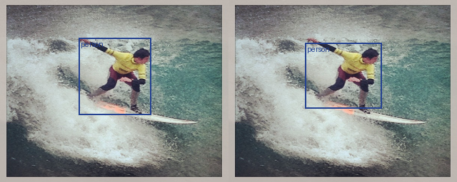
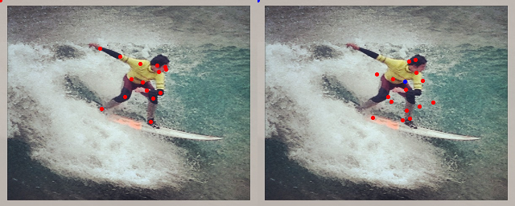
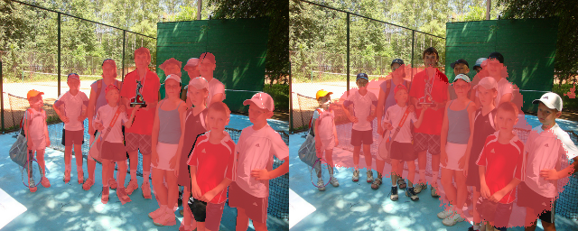
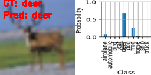
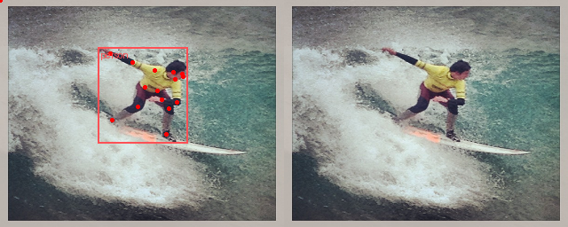

# Visualizers

## Table Of Contents

- [BBoxVisualizer](#bboxvisualizer)
- [ClassificationVisualizer](#classificationvisualizer)
- [KeypointVisualizer](#keypointvisualizer)
- [SegmentationVisualizer](#segmentationvisualizer)
- [MultiVisualizer](#multivisualizer)

## BBoxVisualizer

Visualizer for bounding boxes.

**Params**

| Key       | Type                                    | Default value                                          | Description                                                                                                                                                       |
| --------- | --------------------------------------- | ------------------------------------------------------ | ----------------------------------------------------------------------------------------------------------------------------------------------------------------- |
| labels    | dict\[int, str\] \| list\[str\] \| None | None                                                   | Either a dictionary mapping class indices to names, or a list of names. If list is provided, the label mapping is done by index. By default, no labels are drawn. |
| colors    | dict\[int, tuple\[int, int, int\]       | str\] \| list\[tuple\[int, int, int\] \| str\] \| None | None                                                                                                                                                              |
| fill      | bool                                    | False                                                  | Whether or not to fill the bounding boxes.                                                                                                                        |
| width     | int                                     | 1                                                      | The width of the bounding box lines.                                                                                                                              |
| font      | str \| None                             | None                                                   | A filename containing a TrueType font.                                                                                                                            |
| font_size | int \| None                             |                                                        | None                                                                                                                                                              |

**Example**

## KeypointVisualizer

**Params**

| Key                  | Type                              | Default value | Description                                                                                                                      |
| -------------------- | --------------------------------- | ------------- | -------------------------------------------------------------------------------------------------------------------------------- |
| visibility_threshold | float                             | 0.5           | Threshold for visibility of keypoints. If the visibility of a keypoint is below this threshold, it is considered as not visible. |
| connectivity         | list\[tuple\[int, int\]\] \| None | None          | List of tuples of keypoint indices that define the connections in the skeleton.                                                  |
| visible_color        | str                               | "red"         | Color of visible keypoints.                                                                                                      |
| nonvisible_color     | str \| None                       | None          | Color of nonvisible keypoints. If None, nonvisible keypoints are not drawn.                                                      |
| **Example**          |                                   |               |                                                                                                                                  |

## SegmentationVisualizer

**Params**

| Key   | Type  | Default value | Description                            |
| ----- | ----- | ------------- | -------------------------------------- |
| color | str   | #5050FF       | Color of the segmentation masks.       |
| alpha | float | 0.6           | Alpha value of the segmentation masks. |

**Example**

## ClassificationVisualizer

**Params**

| Key          | Type                   | Default value | Description                                                                |
| ------------ | ---------------------- | ------------- | -------------------------------------------------------------------------- |
| include_plot | bool                   | True          | Whether to include a plot of the class probabilities in the visualization. |
| color        | tuple\[int, int, int\] | (255, 0, 0)   | Color of the text.                                                         |
| font_scale   | float                  | 1.0           | Scale of the font.                                                         |
| thickness    | int                    | 1             | Line thickness of the font.                                                |

**Example**

## MultiVisualizer

Special type of meta-visualizer that combines several visualizers into one. The combined visualizers share canvas.

**Params**

| Key         | Type         | Default value | Description                                                                                                                                                                                                                                    |
| ----------- | ------------ | ------------- | ---------------------------------------------------------------------------------------------------------------------------------------------------------------------------------------------------------------------------------------------- |
| visualizers | list\[dict\] | \[ \]         | List of visualizers to combine. Each item in the list is a dictionary with the following keys:   - name (str): Name of the visualizer. Must be a key in the VISUALIZERS registry.   params (dict): Parameters to pass to the visualizer. |

**Example**

Example of combining [KeypointVisualizer](#keypointvisualizer) and [BBoxVisualizer](#bboxvisualizer).

